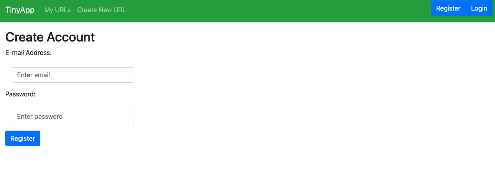
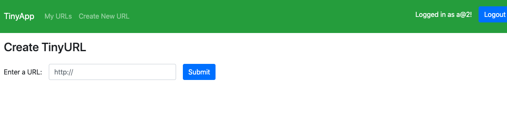
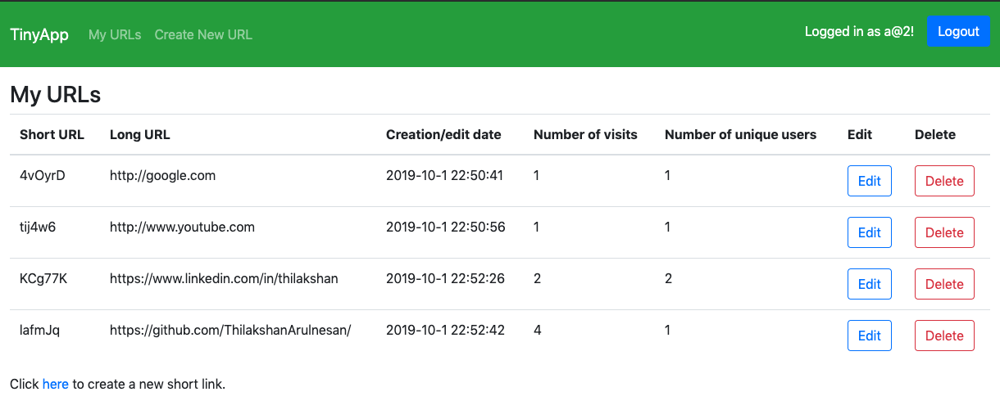
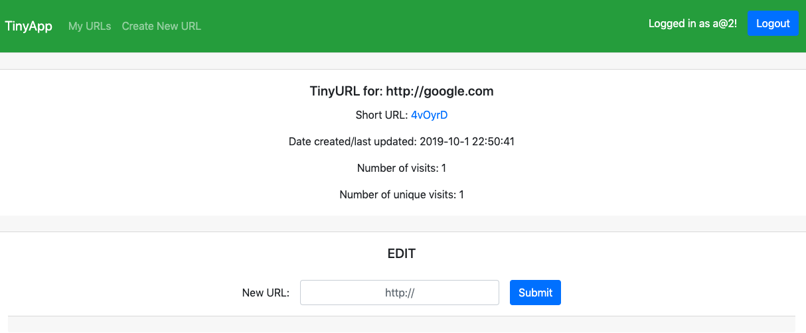

# TinyApp Project

TinyApp is a web application built with Node and Express that allows users to shorten long URLs (à la bit.ly). Users are able to log in, create/modify/update a shortened URL that they can share. TinyApp keeps track of the number of times a shortened link has been used (along with unique users) that is visible to the creator of the shortened url. 

## Final Product

TinyURL has a registration page that takes an e-mail as the user ID along with a password. Once logged in, a user can access their created links. Login is not required to use the shortened URL links. 

Users can create a new tiny URL with a simple click of a button.

Once a link has been created, it will be displayed in the users list of URLs (can be accessed throguh ``exampleDomain.com/urls``). From this page users may delete their TinyApp URLs. They may also press the edit button to change the hyperlink of the short URL.

A user may edit the link to their shortened URL as well as see statistics for the link usage.

## Dependencies

- Node.js
- Express
- EJS
- bcrypt
- body-parser
- cookie-session

## Getting Started

- Install all dependencies (using the `npm install` command).
- Run the development web server using the `node express_server.js` command.

## Future Features
- Anonymous version of site
- Improved styling
